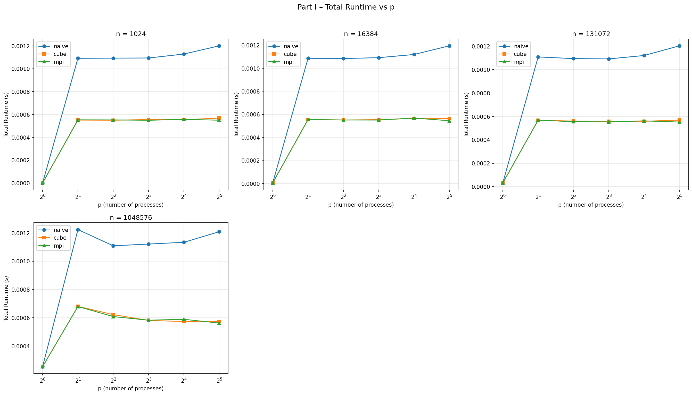
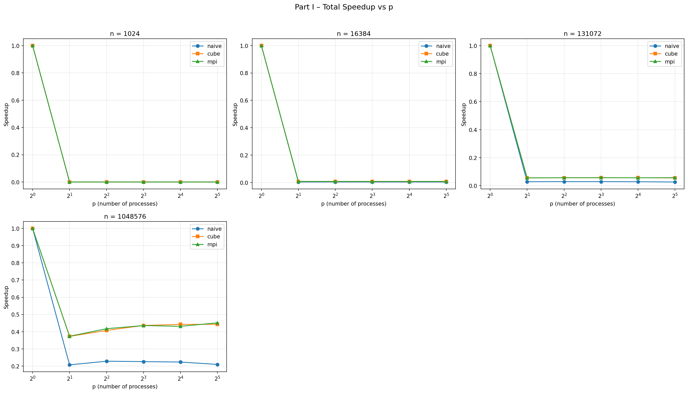
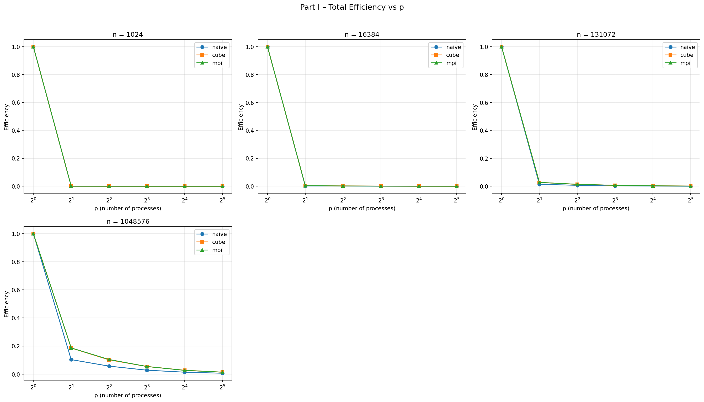
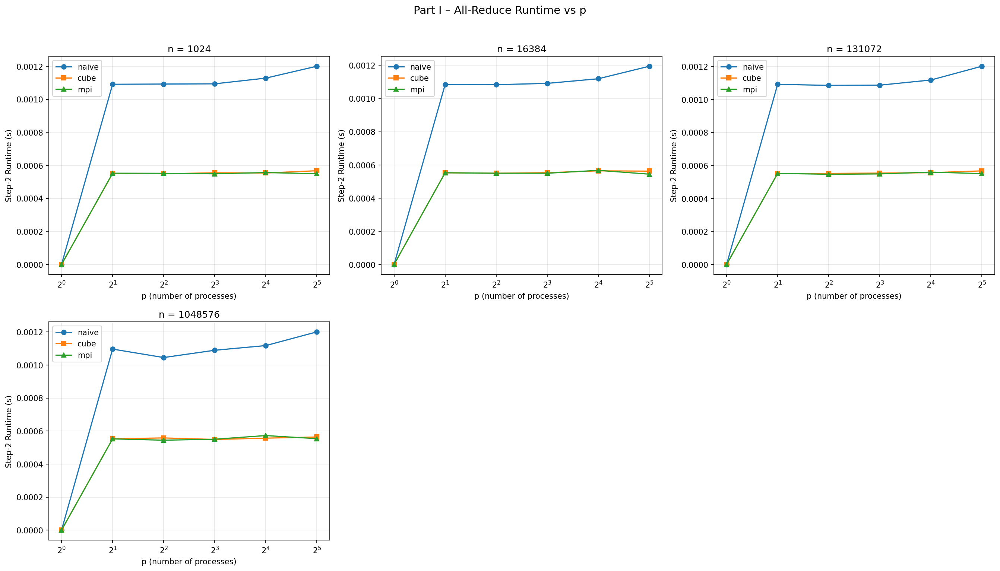
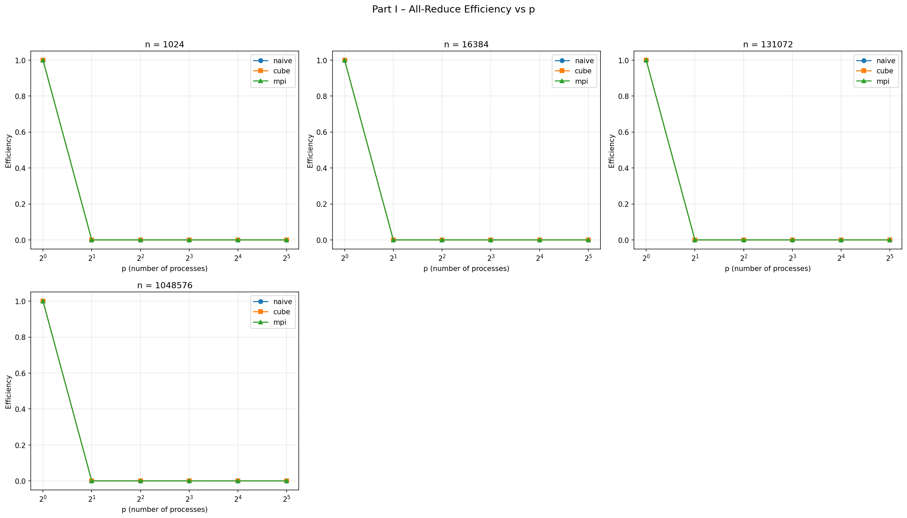
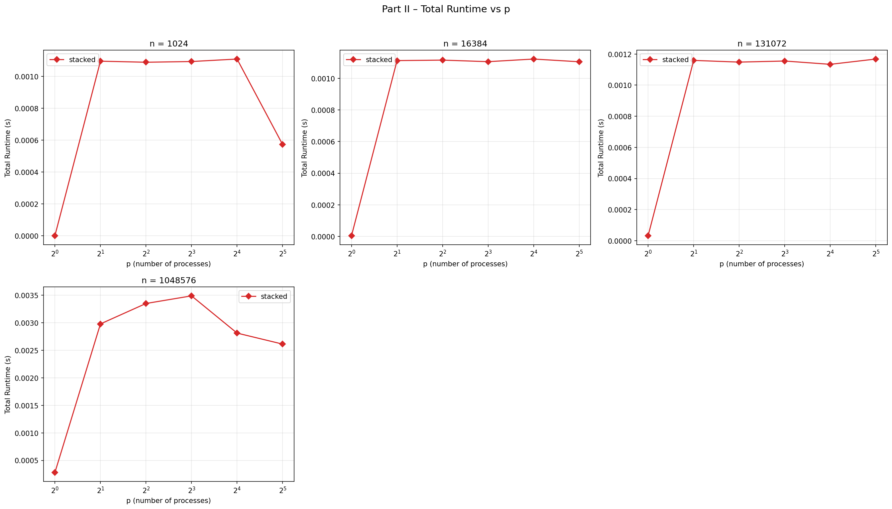
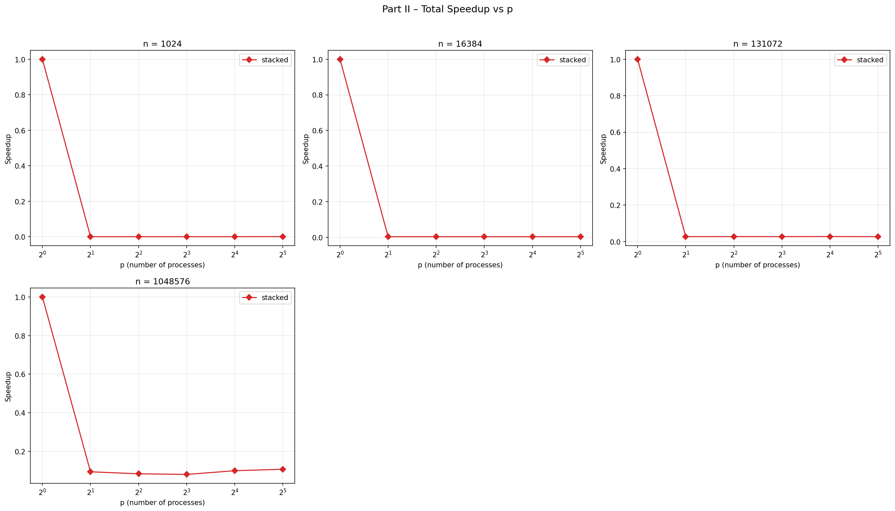
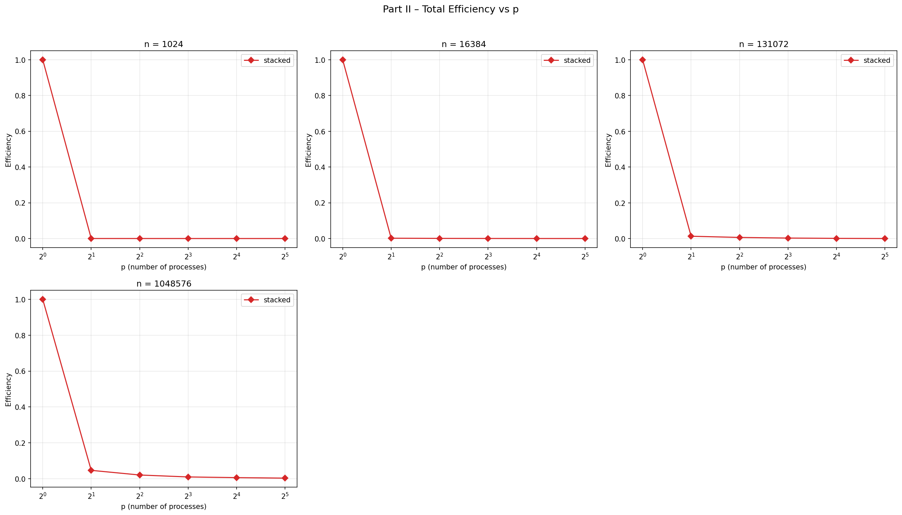
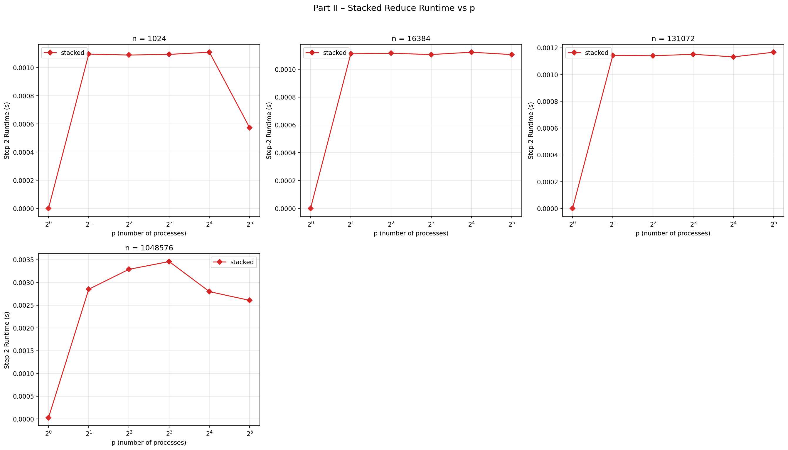
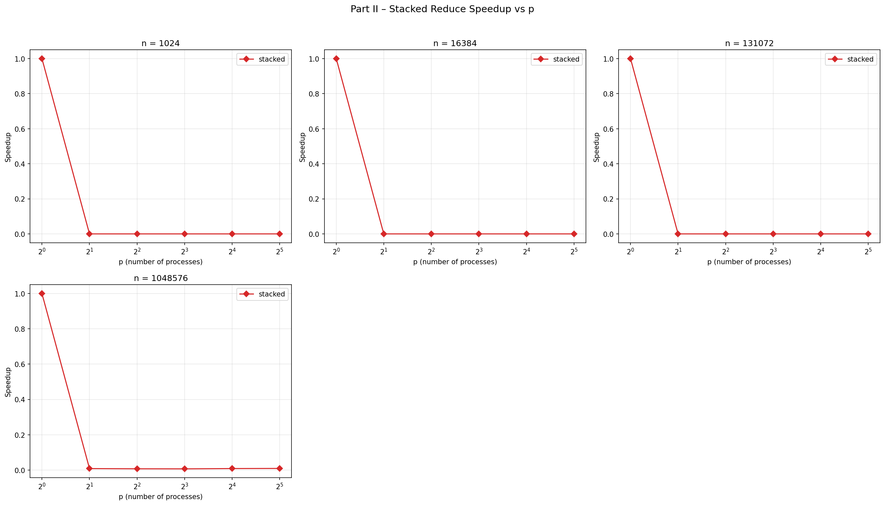

# Programming Project 2: All-Reduce Report

## Part I: Naive vs. Hypercubic vs. MPI All-Reduce

### Total Runtime, Speedup, and Efficiency

### All-Reduce Step Runtime, Speedup, and Efficiency

---

## Part II: StackedReduce

### Total Runtime, Speedup, and Efficiency

### All-Reduce Step Runtime, Speedup, and Efficiency

---

## Justification

Across both parts, communication overhead completely dominates computation. The single-process baseline is fast because summing integers is cheap; the moment MPI enters the picture, per-message startup cost swamps any parallel benefit. This is why speedup drops below 1 at p=2 for all small n and never meaningfully recovers.

Naive is the slowest because its two-pass pipeline requires O(p) sequential messages—each process must wait for its neighbor before forwarding the accumulated sum, so MPI_Sendrecv can't be used there. Hypercubic and MPI_Allreduce both finish in O(log p) rounds with simultaneous exchanges, which is why their curves are nearly identical.

StackedReduce follows the same hypercubic pattern but sends entire local arrays instead of a scalar, so bandwidth cost compounds with n. At n=1,048,576 the runtime actually grows with p rather than flattening, which reflects the increasing message size per round. The step-2 charts mirror total runtime throughout both parts, confirming the local sum is unmeasurably fast compared to communication.
