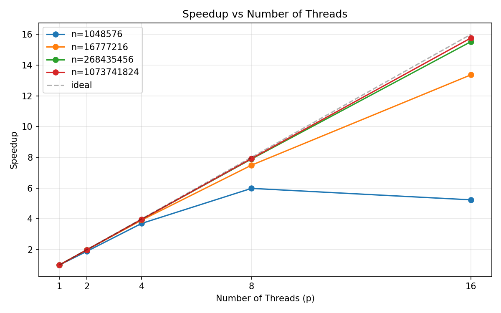
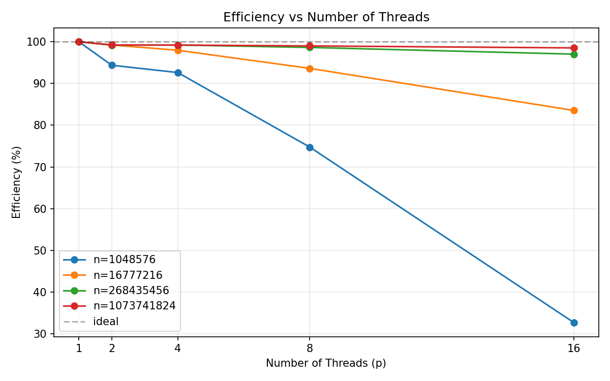
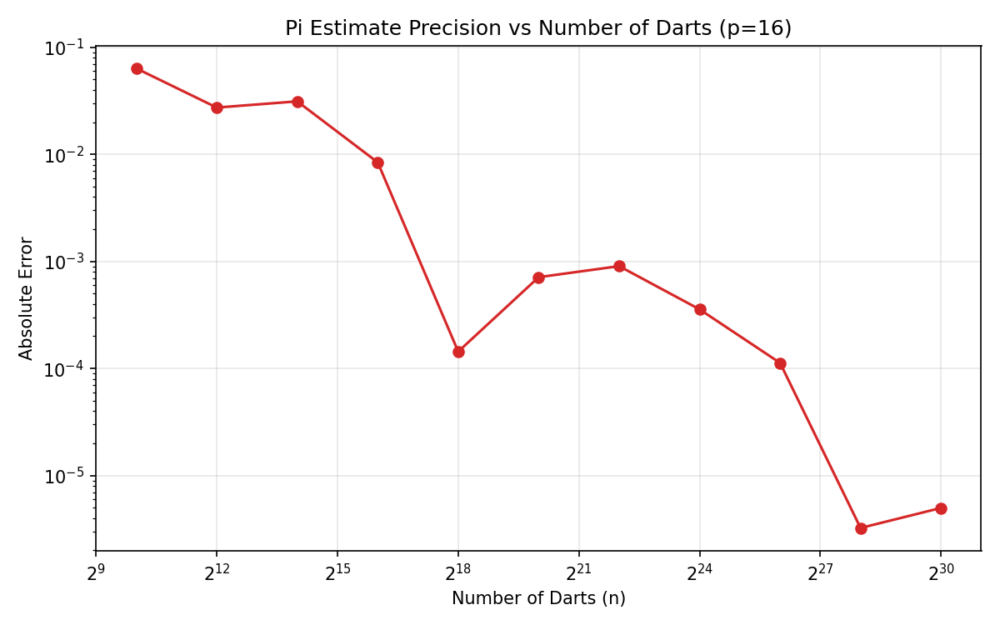

# Pi Estimator Results and Analysis
Dillon Sherling and Kyan Kotschevar-Smead

## Speedup

We ran the pi estimator on the course cluster with different values of n and threads (p) from 1 to 16. Here are the runtimes we got:

| n | p=1 | p=2 | p=4 | p=8 | p=16 |
|---|-----|-----|-----|-----|------|
| 1,024 | 0.000012 | 0.000119 | 0.000121 | 0.000155 | 0.000289 |
| 1,048,576 | 0.006094 | 0.003229 | 0.001645 | 0.001019 | 0.001164 |
| 16,777,216 | 0.097452 | 0.049110 | 0.024871 | 0.013012 | 0.007291 |
| 268,435,456 | 1.556961 | 0.784921 | 0.392297 | 0.197316 | 0.100295 |
| 1,073,741,824 | 6.222217 | 3.135352 | 1.568144 | 0.785658 | 0.394726 |

And the speedups (T1 / Tp):

| n | p=1 | p=2 | p=4 | p=8 | p=16 |
|---|-----|-----|-----|-----|------|
| 1,048,576 | 1.00 | 1.89 | 3.70 | 5.98 | 5.24 |
| 16,777,216 | 1.00 | 1.98 | 3.92 | 7.49 | 13.36 |
| 268,435,456 | 1.00 | 1.98 | 3.97 | 7.89 | 15.52 |
| 1,073,741,824 | 1.00 | 1.98 | 3.97 | 7.92 | 15.77 |

We left n=1024 out of the speedup table cause the times are so tiny its basically all noise. Adding more threads actually made it slower there since thread creation takes longer than the actual work.

For the big inputs though the speedup is really good. n=1B with 16 threads gets 15.77x which is almost the ideal 16x. Makes sense since every dart throw is independent so theres basically no overhead besides creating threads and the atomic add at the end. At n=16M the speedup starts dropping off a bit at 16 threads (13.36x) — not quite enough work per thread to justify all 16.

## Efficiency

Efficiency = Speedup / p

| n | p=1 | p=2 | p=4 | p=8 | p=16 |
|---|-----|-----|-----|-----|------|
| 1,048,576 | 100% | 94.4% | 92.6% | 74.8% | 32.7% |
| 16,777,216 | 100% | 99.2% | 97.9% | 93.6% | 83.5% |
| 268,435,456 | 100% | 99.2% | 99.2% | 98.6% | 97.0% |
| 1,073,741,824 | 100% | 99.3% | 99.3% | 99.0% | 98.5% |

The big inputs stay above 97% efficiency even at 16 threads which is about as good as it gets. n=1M drops hard to 32.7% at 16 threads — each thread only gets like 65K darts which is basically nothing.

## Precision

We fixed p=16 and increased n to see how the estimate gets better:

| n | Pi Estimate | Error |
|---|------------|-------|
| 1,024 | 3.07812500 | 6.35e-02 |
| 4,096 | 3.11425781 | 2.73e-02 |
| 16,384 | 3.11035156 | 3.12e-02 |
| 65,536 | 3.13317871 | 8.41e-03 |
| 262,144 | 3.14144897 | 1.44e-04 |
| 1,048,576 | 3.14088058 | 7.12e-04 |
| 4,194,304 | 3.14068985 | 9.03e-04 |
| 16,777,216 | 3.14123631 | 3.56e-04 |
| 67,108,864 | 3.14170527 | 1.13e-04 |
| 268,435,456 | 3.14158942 | 3.24e-06 |
| 1,073,741,824 | 3.14158767 | 4.98e-06 |

Error goes down as n goes up which is expected for Monte Carlo. It roughly follows O(1/sqrt(n)). Theres some noise in the middle — n=16K is actually worse than n=4K but thats just random variance. By n=268M were getting about 5 correct decimal places which seems right.

## Conclusion

This scales really well since its embarrassingly parallel. Every dart throw is independent so you basically get linear speedup as long as n is big enough. The only thing holding it back is thread overhead for small inputs. Precision wise more darts = better estimate, following the 1/sqrt(n) convergence you'd expect.
